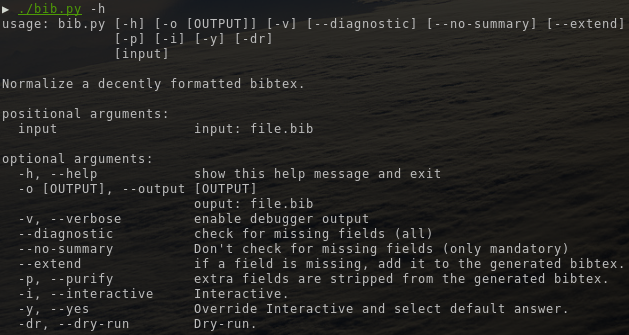
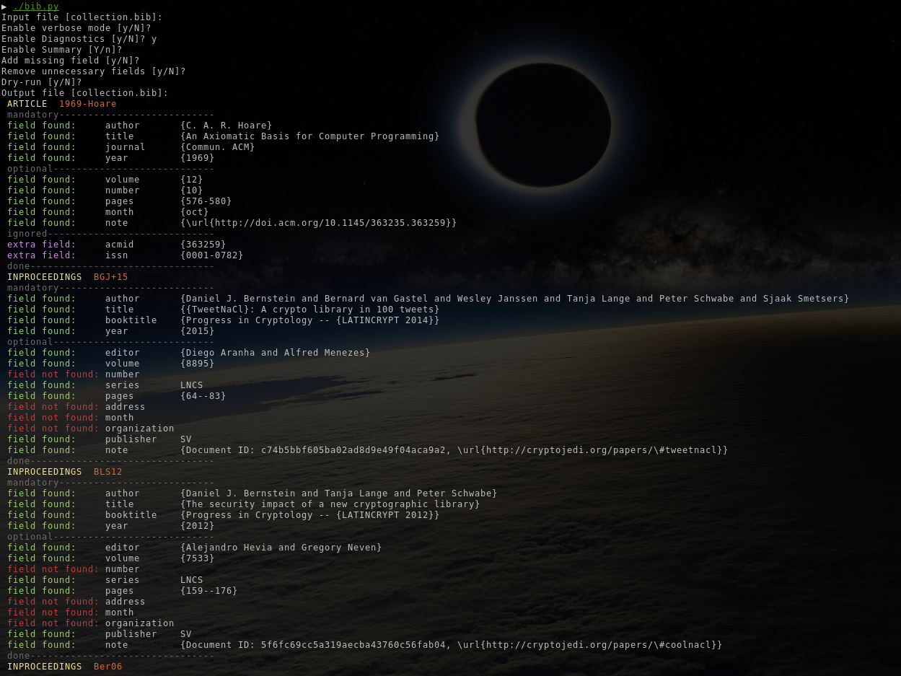

# bib.py
Simple script to align and check your file.bib.

## What does it ?

This script aims to improve your bib file without modifying its content:
- fix alignments
- order entries alphabetically
- warn about missing fields

it also comes with the following options:



## Quick download & execute

**With wget**

```
python3 -c "$(wget -O- https://raw.githubusercontent.com/ildyria/bib.py/master/bib.py)"
```

**With curl**

```
python3 -c "$(curl -fsSL https://raw.githubusercontent.com/ildyria/bib.py/master/bib.py)"
```

**Clone**

```
git clone https://github.com/ildyria/bib.py.git
```

## How to use it ?

Just execute `bib.py` with either:

```
./bib.py
```

or

```
python3 bib.py
```

## Examples


